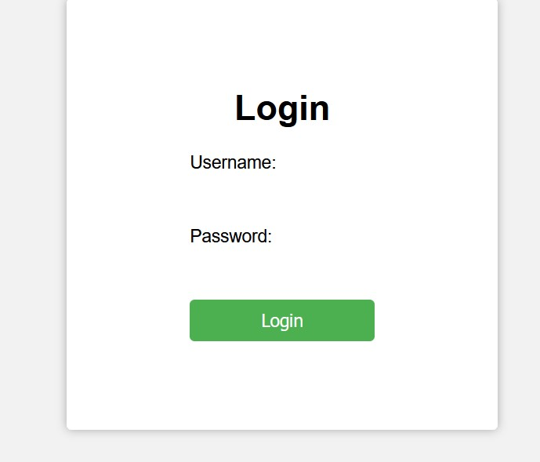
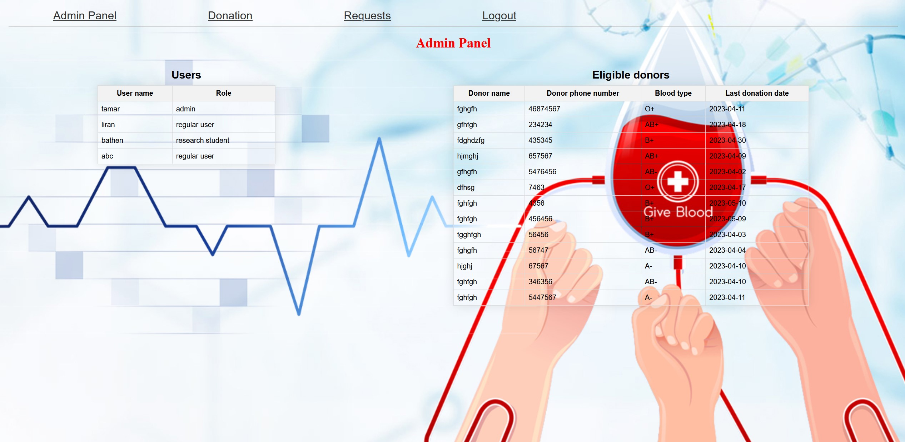
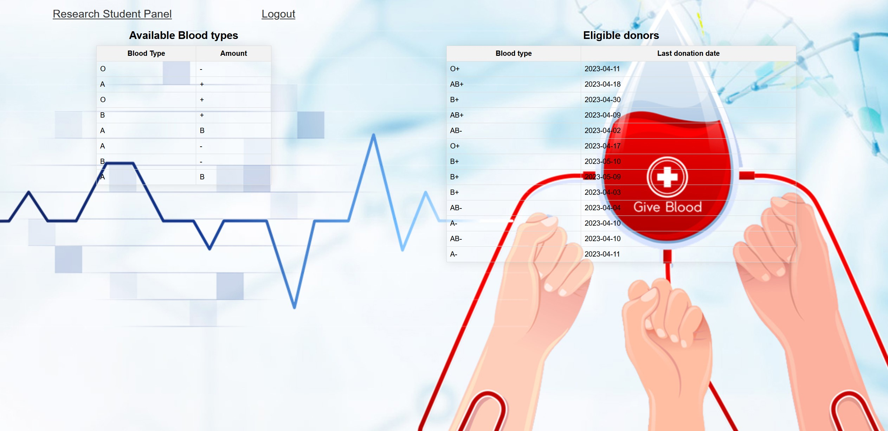
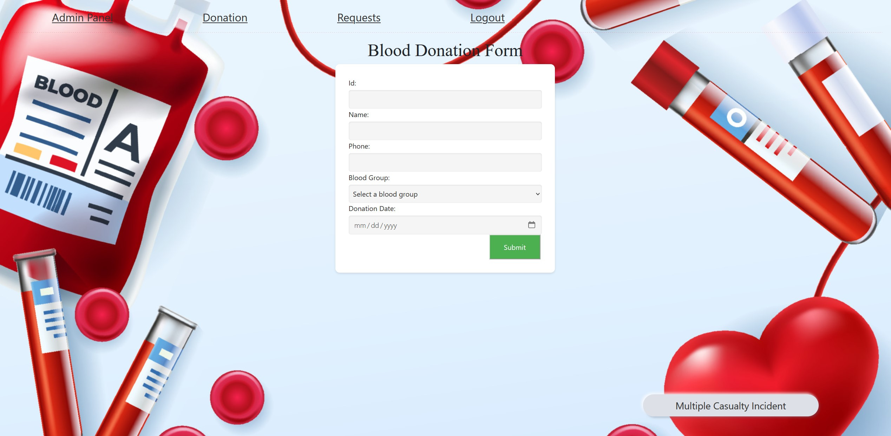
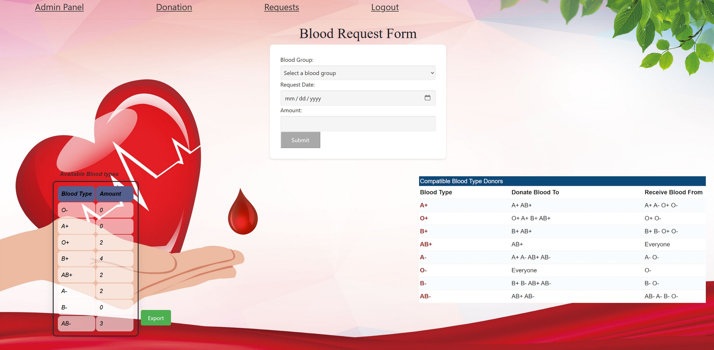

# Blood Donation Website
Welcome to the Blood Donation Website! This web application allows users to make blood donation requests, submit donation offers, and provides administrative control for managing users and donations. The website is built using Flask, MySQL, HTML, and CSS.

This project was a part of a course for Introduction to biomedical software
for now the project isn't online.

# Features
User Login: Users can log in to the website either as Admin, Reaserch student or Regular user.
Blood Donation Request: Users can submit blood donation requests, providing necessary details such as blood type, contact information, also multiple casulty incident feature that asks only for blood type O-.
Donation Offers: Users can submit offers to donate blood, specifying their blood type, the date of request and amount of blood.
Admin Panel: Administrators have access to an admin panel to manage user accounts, view donation requests,export the amount of available blood types, and oversee the blood donation process.
Research Student Panel: Research students have access to a panel where they can access the available blood types.

